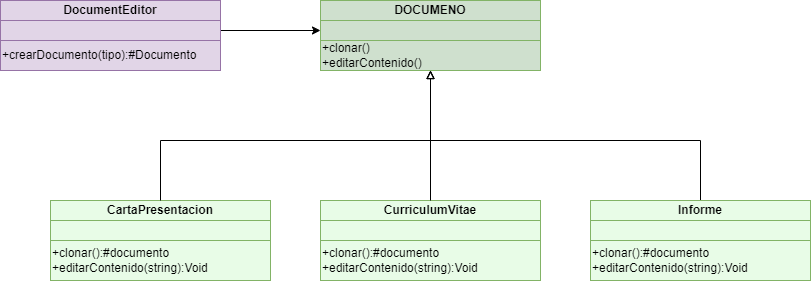

# Document Editor con Patrón Prototype

Este proyecto implementa un **Editor de Documentos** que permite a los usuarios crear nuevos documentos a partir de plantillas predefinidas utilizando el **Patrón Prototype** en JavaScript. El editor incluye plantillas para currículum vitae, cartas de presentación e informes, que pueden clonarse y personalizarse sin afectar las plantillas originales.

## Características

- **Patrón Prototype**: El proyecto utiliza el patrón de diseño Prototype para clonar plantillas y crear nuevos documentos de manera eficiente.
- **Principios SOLID**: El código se organiza siguiendo los principios SOLID para mejorar la mantenibilidad y modularidad.
- **Interfaz de Usuario**: Permite a los usuarios seleccionar una plantilla y crear un nuevo documento basado en ella.

## Diagrama de Clases del patron prototype



## Interaactuar con la aplicacion

Si desea interactuar con la aplicacion puede hacerlo a travez de la pagina web desplegada en el siguiente link, tenga en cuenta que no existe una interfaz grafica como tal, el resultado se imprime por consola:
https://adep-123.github.io/implementacionPatronPrototype/

Por otro lado si desea copiar el repositorio puede realizarlo con el siguiente comando git en su ordenador, recuerde que debe tener instalado git:
```bash
- git clone https://github.com/ADEP-123/implementacionPatronPrototype.git
```
Posteriormente de copiar el repositorio puede abrir el archivo index.html desde local, o con un ambiente de desarrollo como visual studio code y una extension como LiveServer
